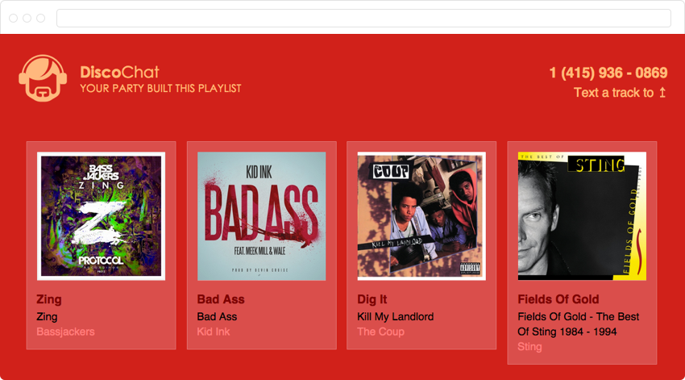
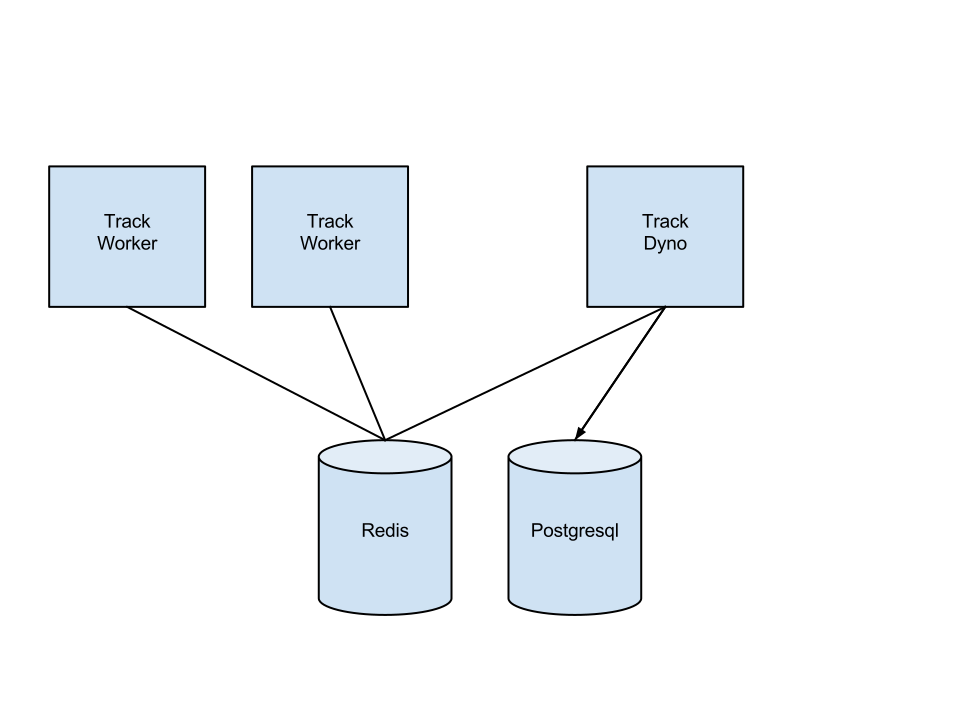

# Disco Chat

A Node.js application used to show-off my favorite Heroku features. Though
it could easily be adapated to power the playlist at your next party.

*This is what it once looked like:*

## Development Dependencies

| Dependency                              | Config Vars (see .env-example)        |
| --------------------------------------- | ------------------------------------- |
| [Node V4.0](https://nodejs.org/en/)     | N/A                                   |
| [Postgres](http://www.postgresql.org/)  | DATABASE_URL                          |
| [Redis](http://redis.io/)               | REDIS_URL                             |
| [RDIO](http://www.rdio.com/developers/) | RDIO_CLIENT_ID, RDIO_CLIENT_SECRET    |
| [Twilio](https://www.twilio.com)        | N/A                                   |

Twilio is used to proxy track requests sent via. SMS messages, the relevant endpoint
is `http://{*}.herokuapp.com/api/sms`.

You can expose this endpoint if you're working locally with something like [ngrok](https://ngrok.com/docs#expose)

## App Architecture

## Install

1. `npm install` - Install dependencies

## Run

1. `heroku local` - Start the app
2. `gulp` - live reload/compilation (seperate CLI tab)

## Test

1. `npm test` - To date, this is only configured to validate w. [standards](https://github.com/feross/standard).`
